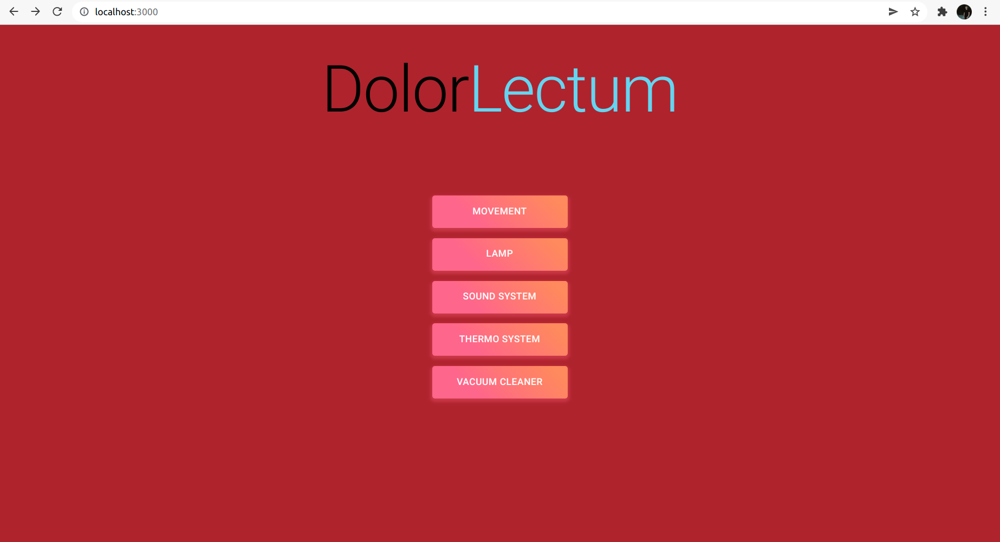

# DolorLectum
Langua rumena est mucho smecherosa.

DolorLectum este o suita de dispozitive (mock) ce stau in componenta unui pat inteligent. Dispozitivele sunt cele ce urmeaza:
- sistem de sunet programabil
- mecanisme pentru pozitionarea televizorului incorporat
- aspirator inteligent pentru saltea
- termostat inteligent
- lampa inteligenta

DolorLectum este livrat impreuna cu o interfata web ce usureaza interactionarea cu dispozitivele.

## Cum pornesc proiectul?
`docker-compose up` va porni toate aplicatiile, toate in aceasi retea. Interfata web se afla la adresa http://localhost:3000.

## Manual de utilizare functionalitati

In paragrafele de mai jos vor fi descrise functionalitatile dispozitivelor si cum pot fi acestea utilizate pentru o experienta de neuitat cu DolorLectum.

#### 👉 Meniu

Aveti la dispozitie un meniu prin care puteti selecta dispozitivul pe care doriti sa il controlati.



#### 👉 TV Movement

Controlul pozitiei televizorului poate fi realizat cu usurinta prin intermediul interfetei, ajustand astfel dispozitivul dupa preferintele utilizatorului.


Dupa un anumit interval de timp televizorul revine la forma inactiva pentru a motiva utilizatorul sa isi inceapa ziua, conform cerintelor venite din partea clientilor.


#### 👉 Lamp

Lampa vine la pachet cu 3 moduri de functionare si o telecomanda prin care putem seta culorile acesteia.


#### 👉 Sound System

Sistemul de sunet functioneaza pe baza unei cozi de melodii alese de utilizator. Acesta poate intrerupe sau porni oricand melodiile cu ajutorul interfetei.


Tot acest sistem are la baza o colectie de melodii inregistrate de catre utilizator in memorie, pe baza carora isi poate crea propriul playlist.


#### 👉 Thermo System

Sistemul termic contribuile la calitatea somnului, iar pentru aceasta am integrat de asemenea un control digital.


#### 👉 Vacuum Cleaner

Aspiratorul vine la pachet cu controlul digital oferit de catre echipa noastra de dezvoltare.


## Criterii de notare

1. Toate dispozitivele au specificatii OpenAPI ex. [soundsystem](./soundsystem/openapi.yaml), [lamp](./lamp/openapi.yaml). Unele dispozitive au specificatii AsyncAPI ex. [soundsystem](./soundsystem/async.yaml) [mattress_vacuum](./mattress_vacuum/asyncapi.yaml). Avem 5 dispozitive cu multiple functionalitati. (2.5p)
2. Toate dispozitivele au teste unitare asociate, ex. [soundsystem](./soundsystem/handlers/api_default_test.go). (1.5p)
3. Documentatia de analiza se gaseste in [repo](./Document de analiza.pdf). (1p)
4. Documentatia de utilizare se gaseste in acest README. (1p)
5. Am folosit RESTler pentru testarea automata a endpointurilor. (1.5p)
```
dolorlectum-restler-1  | 2. Fuzz target
dolorlectum-restler-1  | Starting task Test...
dolorlectum-restler-1  | Using python: 'python3' (Python 3.8.10)
dolorlectum-restler-1  | Request coverage (successful / total): 2 / 3
dolorlectum-restler-1  | Bugs were found!
dolorlectum-restler-1  | Bug buckets:
dolorlectum-restler-1  |
dolorlectum-restler-1  | main_driver_500: 1

-> POST /status HTTP/1.1\r\nAccept: application/json\r\nHost: lamp:8085\r\nContent-Type: application/json\r\n\r\n"fuzzstring"\r\n
! producer_timing_delay 0
! max_async_wait_time 20
PREVIOUS RESPONSE: 'HTTP/1.0 500 INTERNAL SERVER ERROR\r\nContent-Type: application/problem+json\r\nContent-Length: 251\r\nServer: Werkzeug/2.0.2 Python/3.10.2\r\nDate: Sun, 30 Jan 2022 13:32:39 GMT\r\n\r\n{\n  "detail": "The server encountered an internal error and was unable to complete your request. Either the server is overloaded or there is an error in the application.",\n  "status": 500,\n  "title": "Internal Server Error",\n  "type": "about:blank"\n}\n'
```

6. Testele au coverage 80%+. (0.5p)


7. Exista teste de integrare si teste end2end. (1.5p)

Total punctaj: 2.5 + 1.5 + 1 + 1 + 1.5 + 0.5 + 1.5 + 1 (oficiu) = **10.5**
